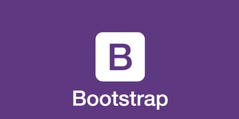

# bootsrap-for-electron

### What is bootsrap-for-electron?

A simple package for building an amazing electron application using bootstrap.
  

### Installing

    npm install bootsrap-for-electron

### Getting started

In the head section of your html page, paste the following: 

    <link rel="stylesheet" href="node_modules/bootstrap-it/resources/bootstrap.min.css"> 

In the body section of the page just above the closing body tag of your HTML page paste the following:

    
    
    

You have now linked all the necessary files to use bootstrap on your electron app.

### Reason to install bootstrap via npm

The reason to have bootstrap in local is the usability of your desktop application when the internet connection isn't available.

If you want to use Bootstrap without an npm package in an electron application, you must download the necessary files, copy and paste them into a folder, and copy/paste the correct path into the HTML or template engines file links in case you are using one.

Updating Bootstrap without an npm package is time consuming and error prone because you have to re-upload every single file every time. 

**bootsrap-for-electron package** take care of everything without hassle.
